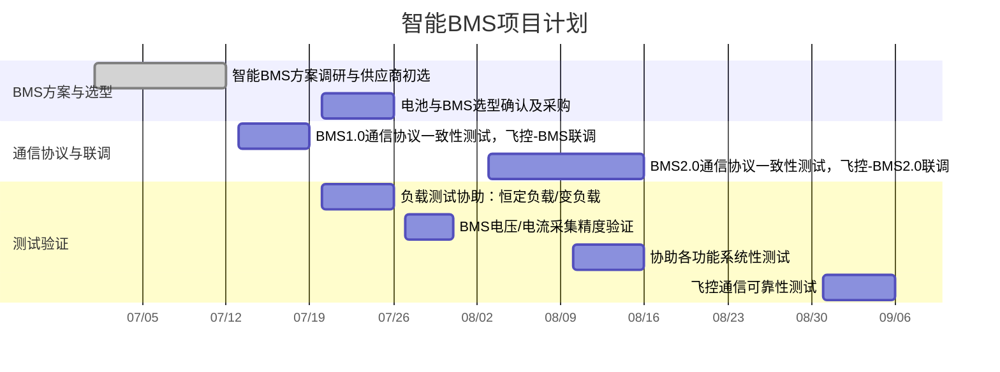

# 智能BMS项目甘特图

```mermaid
gantt
    title 智能BMS项目计划
    dateFormat  YYYY-MM-DD
    axisFormat  %m/%d

    section BMS方案与选型
    智能BMS方案调研与供应商初选 :done, task1, 2026-07-01, 2026-07-12
    电池与BMS选型确认及采购 :task3, 2026-07-20, 2026-07-26

    section 通信协议与联调
    BMS1.0通信协议一致性测试，飞控-BMS联调 :task2, 2026-07-13, 2026-07-19
    BMS2.0通信协议一致性测试，飞控-BMS2.0联调 :task6, 2026-08-03, 2026-08-16

    section 测试验证
    负载测试协助：恒定负载/变负载 :task4, 2026-07-20, 2026-07-26
    BMS电压/电流采集精度验证 :task5, 2026-07-27, 2026-07-31
    协助各功能系统性测试 :task7, 2026-08-10, 2026-08-16
    飞控通信可靠性测试 :task8, 2026-08-31, 2026-09-06
```
